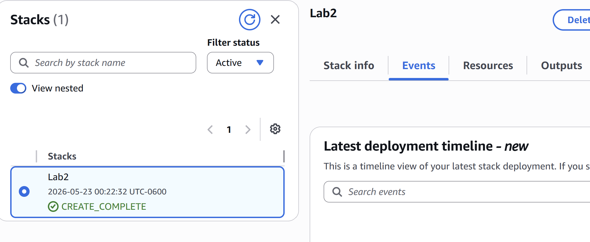
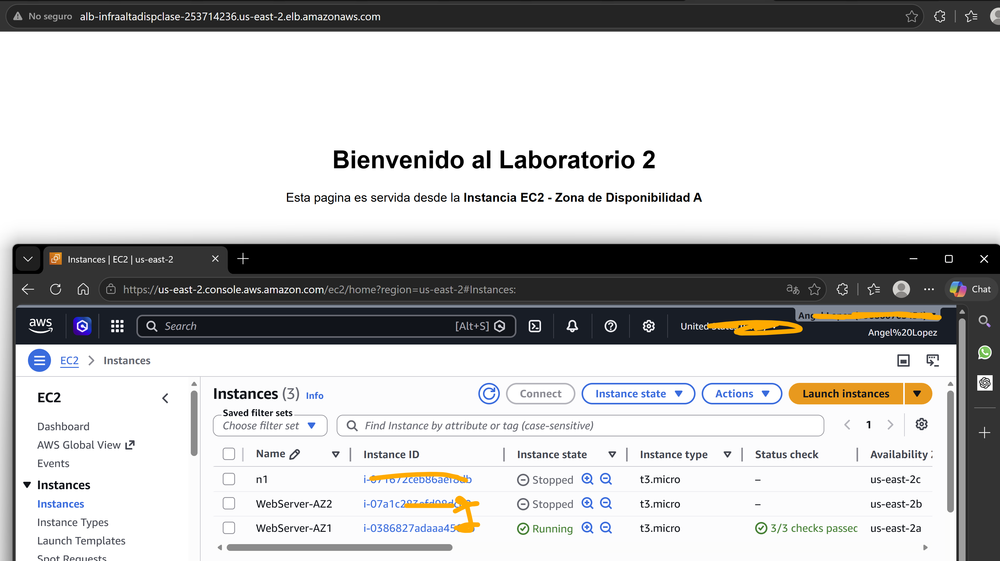
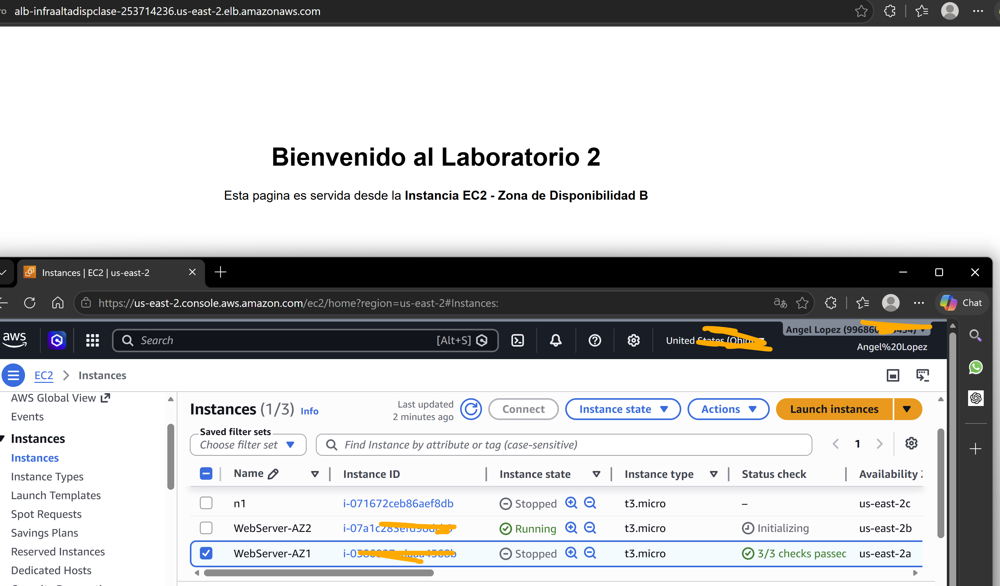
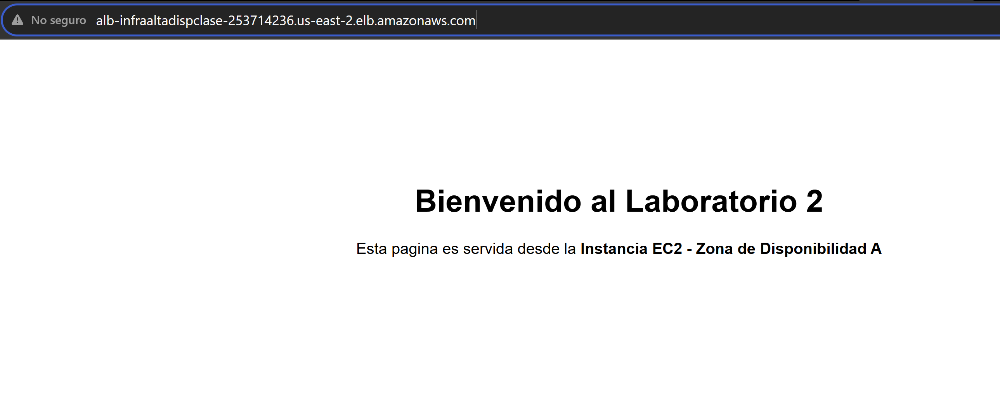
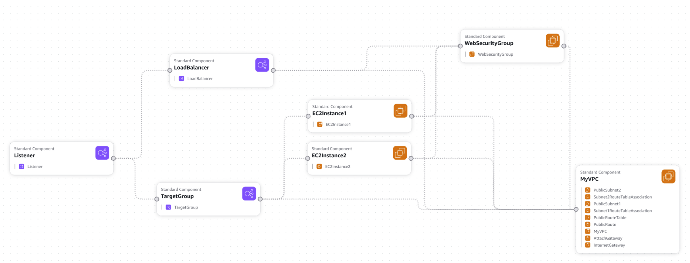

# Universidad de San Carlos de Guatemala  
## Maestría en Tecnologías de la Información y la Comunicación  
### Administración de Proyectos  

<p align="center">
  
</p>

# Laboratorio 2  
# Infraestructura en Alta Disponibilidad con NGINX usando AWS CloudFormation

---

# Información General

| Campo | Descripción |
|---|---|
| Curso | Análisis y Diseño de Arquitecturas de Sistemas |
| Plataforma | AWS |
| Herramienta | AWS CloudFormation |
| Arquitectura | Alta Disponibilidad |
| Servidor Web | NGINX |
| Servicios AWS | EC2, ELB, VPC, Security Groups |

---

# Introducción

En este laboratorio se implementó una infraestructura de alta disponibilidad utilizando AWS CloudFormation y Amazon EC2.  

La arquitectura desplegada contiene dos instancias EC2 distribuidas en diferentes zonas de disponibilidad, ambas ejecutando NGINX como servidor web y conectadas mediante un Load Balancer.  

El objetivo fue automatizar la creación de infraestructura mediante Infrastructure as Code (IaC) usando archivos YAML.

---

# ¿Qué es AWS CloudFormation?

AWS CloudFormation es un servicio de Amazon Web Services que permite crear y administrar infraestructura mediante código.  

Con CloudFormation es posible desplegar recursos como:

- Instancias EC2
- Redes VPC
- Load Balancers
- Security Groups
- Bases de datos
- Servicios de almacenamiento

Todo se define dentro de una plantilla YAML o JSON.

---

# Ventajas de AWS CloudFormation

- Automatización de infraestructura.
- Reducción de errores manuales.
- Fácil mantenimiento.
- Infraestructura reutilizable.
- Integración con GitHub.
- Implementación rápida.
- Escalabilidad.

---

# Desventajas de AWS CloudFormation

- Curva de aprendizaje inicial.
- Plantillas complejas pueden ser difíciles de mantener.
- Dependencia de AWS.
- Los errores YAML pueden detener despliegues.
- Algunos recursos tardan varios minutos en crearse.

---

# Arquitectura Implementada

La infraestructura creada contiene:

- 1 VPC
- 2 Subnets públicas
- 1 Internet Gateway
- 1 Route Table
- 1 Security Group
- 2 Instancias EC2
- 1 Application Load Balancer
- 1 Target Group
- 1 Listener HTTP

La arquitectura permite mantener disponibilidad del servicio aunque una instancia falle.

---

# Explicación de la Plantilla YAML

## Parameters

```yaml
Parameters:

  KeyName:
    Description: Nombre del KeyPair SSH existente en AWS
    Type: AWS::EC2::KeyPair::KeyName
```

Se utiliza para solicitar el nombre de la llave SSH que permitirá conectarse a las instancias EC2.

---

## VPC

```yaml
MyVPC:
  Type: AWS::EC2::VPC
```

La VPC es la red privada principal donde se desplegarán todos los recursos.

---

## Subnets

```yaml
PublicSubnet1
PublicSubnet2
```

Las subnets permiten distribuir instancias en diferentes zonas de disponibilidad.

---

## Internet Gateway

```yaml
InternetGateway
```

Permite acceso a Internet para las instancias EC2.

---

## Route Table

```yaml
PublicRouteTable
```

Define las rutas de comunicación hacia Internet.

---

## Security Group

```yaml
WebSecurityGroup
```

Permite tráfico:

- SSH → Puerto 22
- HTTP → Puerto 80

---

## EC2 Instances

```yaml
EC2Instance1
EC2Instance2
```

Son los servidores virtuales donde se instala automáticamente NGINX.

---

# Instalación Automática de NGINX

La instalación se realiza mediante UserData:

```yaml
UserData:
  Fn::Base64: !Sub |
    #!/bin/bash

    yum update -y

    amazon-linux-extras install nginx1 -y

    systemctl start nginx
    systemctl enable nginx
```

Este bloque ejecuta comandos automáticamente cuando inicia la instancia.

---

# Página Web Automática (index.html)

Dentro del YAML también se crea automáticamente un archivo HTML para verificar el funcionamiento de NGINX.

```yaml
cat <<EOF > /usr/share/nginx/html/index.html
<!DOCTYPE html>
<html lang="es">
<head>
    <meta charset="UTF-8">
    <title>Laboratorio CloudFormation</title>
</head>

<body>

    <h1>Bienvenido al Laboratorio de AWS CloudFormation</h1>

    <h2>NGINX funcionando correctamente</h2>

    <p>Infraestructura en Alta Disponibilidad</p>

</body>
</html>
EOF
```

El archivo se almacena en:

```bash
/usr/share/nginx/html/index.html
```

y es servido automáticamente por NGINX.

---

# Load Balancer

```yaml
ApplicationLoadBalancer
```

El Load Balancer distribuye tráfico entre ambas instancias EC2.

Si una instancia falla, automáticamente redirige tráfico hacia la otra instancia disponible.

---

# Alta Disponibilidad

La infraestructura implementa alta disponibilidad mediante:

- Balanceador de carga.
- Dos zonas de disponibilidad.
- Redundancia de servidores.
- Distribución automática de tráfico.

---

# Resultados Obtenidos

Durante el laboratorio se logró:

- Automatizar infraestructura con CloudFormation.
- Desplegar NGINX automáticamente.
- Acceder al sitio web desde el Load Balancer.
- Simular tolerancia a fallos.
- Visualizar recursos desde CloudFormation Designer.

---

# Conclusión

AWS CloudFormation facilita enormemente la automatización de infraestructura mediante código.  

El laboratorio permitió comprender conceptos importantes como Infrastructure as Code (IaC), balanceo de carga, alta disponibilidad y automatización de despliegues utilizando servicios de AWS.

---

# Repositorio GitHub

```text
https://github.com/usuario/repositorio
```

---

# Evidencias

## Pila CREATE_COMPLETE

<p align="center">
  
</p>

---

## Instancias EC2

<p align="center">
  
</p>
<p align="center">
  
</p>

---

## Sitio Web Funcionando

<p align="center">
  
</p>

---

## CloudFormation Designer

<p align="center">
  
</p>

---

# Comentario Personal

Durante este laboratorio aprendí cómo automatizar infraestructura utilizando AWS CloudFormation y YAML. También comprendí la importancia de la alta disponibilidad mediante balanceadores de carga y múltiples zonas de disponibilidad. Finalmente, pude observar cómo Infrastructure as Code permite implementar arquitecturas de forma rápida, ordenada y reutilizable.
